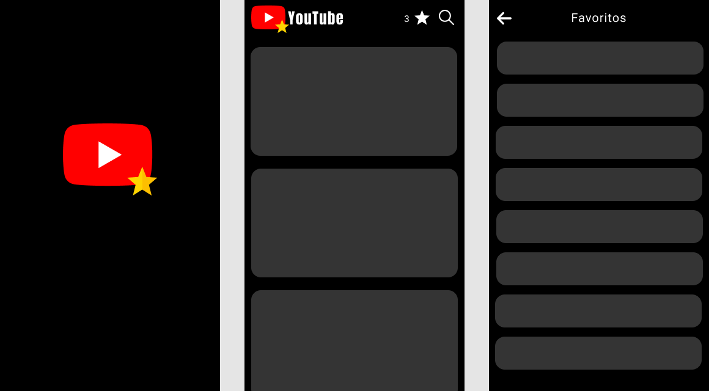

# Youtube Favorites

---

Mobile application that allows you to search for videos on Youtube, view them in a player in the application itself and also save your favorite videos in a favorites list. Developed in flutter, inspired by App # 9 of Daniel Ciolfi's course.

 

## Features

- **Flutter** -  A framework developed by Google in the Dart language.

## Getting Started

1. Clone this repo using `git clone https://github.com/felipebufelli/favorite_youtube.git`
2. Move yourself to the appropriate directory: `cd favorite_youtube`
3. Run `flutter run` to start the mobile app.

Note: If you choose to start the mobile app in the android emulator, you will have to start the emulator before.